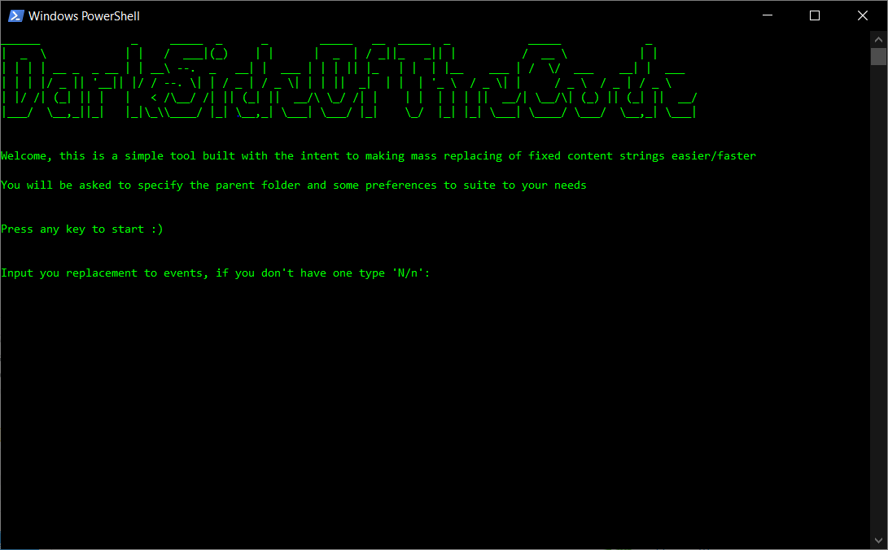

<!--
*** Thanks for checking out the Best-README-Template. If you have a suggestion
*** that would make this better, please fork the repo and create a pull request
*** or simply open an issue with the tag "enhancement".
*** Thanks again! Now go create something AMAZING! :D
***
***
***
*** To avoid retyping too much info. Do a search and replace for the following:
*** GianmarcoAquilano, repo_name, twitter_handle, email, project_title, project_description
-->


<!-- PROJECT SHIELDS -->
<!--
*** I'm using markdown "reference style" links for readability.
*** Reference links are enclosed in brackets [ ] instead of parentheses ( ).
*** See the bottom of this document for the declaration of the reference variables
*** for contributors-url, forks-url, etc. This is an optional, concise syntax you may use.
*** https://www.markdownguide.org/basic-syntax/#reference-style-links
-->
[![Contributors][contributors-shield]][contributors-url]
[![Forks][forks-shield]][forks-url]
[![Stargazers][stars-shield]][stars-url]
[![Issues][issues-shield]][issues-url]
[![GNU GPLv3 License][license-shield]][license-url]


<!-- PROJECT LOGO -->
<br />
<p align="center">
  <a href="https://github.com/GianmarcoAquilano/FiveM-Easy-Replacer">
    
  </a>

  <h3 align="center">FiveM-Easy-Replacer</h3>

  <p align="center">
    A simple PowerShell script for make redundant replaces faster into Lua files
    <br />
    <br />
    <a href="https://github.com/GianmarcoAquilano/FiveM-Easy-Replacer/issues">Report Bug</a>
    ·
    <a href="https://github.com/GianmarcoAquilano/FiveM-Easy-Replacer/issues">Request Feature</a>
  </p>
</p>


<!-- TABLE OF CONTENTS -->
<details open="open">
  <summary><h2 style="display: inline-block">Table of Contents</h2></summary>
  <ol>
    <li>
      <a href="#about-the-project">About The Project</a>
      <ul>
        <li><a href="#built-with">Built With</a></li>
      </ul>
    </li>
    <!-- <li>
      <a href="#getting-started">Getting Started</a>
      <ul>
        <li><a href="#prerequisites">Prerequisites</a></li>
        <li><a href="#installation">Installation</a></li>
      </ul>
    </li> -->
    <li><a href="#usage">Usage</a></li>
    <li><a href="#contributing">Contributing</a></li>
    <li><a href="#license">License</a></li>
    <li><a href="#contact">Contact</a></li>
    <li><a href="#acknowledgements">Acknowledgements</a></li>
  </ol>
</details>


<!-- ABOUT THE PROJECT -->
## About The Project
<br />

 <a href="https://github.com/GianmarcoAquilano/FiveM-Easy-Replacer">
    
 </a>

<br />
I made this little script for personal use, this is the first time i get in touch with PowerShell, so don't be rude. I made this in about 30 min starting with 0 knowledge of language helping myself with documentation. It has been fun! I tested it a little, if you have feature request or want to report bug, feel free to do it.
I also signed the script with a digital sign to avoid messing with ExecutionPolicy, by the way the first time you run it you will be prompted because i'm not a trusted publisher :)


### Built With

* [PowerShell]()


<!-- GETTING STARTED -->
## Getting Started

To get a local copy up and running follow these simple steps.

### Installation

1. Clone the repo
   ```sh
   git clone https://github.com/GianmarcoAquilano/FiveM-Easy-Replacer.git
   ```
2. Right Click - Run With Powershell or execute it into command line
   ```sh
   PS cd path_to_file/
   PS ./PS_Fivem_Replacer
   ```

<!-- USAGE EXAMPLES -->
## Usage

The features are quite simple at the moment, you can replace event prefix (only esx atm) with desired one and replace MySQL library events with GHMattiMySql's one
Example:
```sh
esx:getSharedObject
``` 
will become
```sh
desired_text:getSharedObject
```

<!-- CONTRIBUTING -->
## Contributing

Contributions are what make the open source community such an amazing place to be learn, inspire, and create. Any contributions you make are **greatly appreciated**.

1. Fork the Project
2. Create your Feature Branch (`git checkout -b feature/AmazingFeature`)
3. Commit your Changes (`git commit -m 'Add some AmazingFeature'`)
4. Push to the Branch (`git push origin feature/AmazingFeature`)
5. Open a Pull Request

<!-- LICENSE -->
## License

Distributed under the GNU GPLv3 License. See `LICENSE` for more information.


<!-- CONTACT -->
## Contact

[Discord](https://discord.com/users/179289479360675840)

Project Link: [https://github.com/GianmarcoAquilano/FiveM-Easy-Replacer](https://github.com/GianmarcoAquilano/FiveM-Easy-Replacer)


<!-- ACKNOWLEDGEMENTS -->
## Acknowledgements

* [Text replacement is CASE SENSITIVE, so watch out when you will type it]
* [The folder you will asked to select is the parent folder, so all .lua files in the subdirectories will be processed too]


<!-- MARKDOWN LINKS & IMAGES -->
<!-- https://www.markdownguide.org/basic-syntax/#reference-style-links -->
[contributors-shield]: https://img.shields.io/github/contributors/GianmarcoAquilano/FiveM-Easy-Replacer.svg?style=for-the-badge
[contributors-url]: https://github.com/GianmarcoAquilano/FiveM-Easy-Replacer/graphs/contributors
[forks-shield]: https://img.shields.io/github/forks/GianmarcoAquilano/FiveM-Easy-Replacer.svg?style=for-the-badge
[forks-url]: https://github.com/GianmarcoAquilano/FiveM-Easy-Replacer/network/members
[stars-shield]: https://img.shields.io/github/stars/GianmarcoAquilano/FiveM-Easy-Replacer.svg?style=for-the-badge
[stars-url]: https://github.com/GianmarcoAquilano/FiveM-Easy-Replacer/stargazers
[issues-shield]: https://img.shields.io/github/issues/GianmarcoAquilano/FiveM-Easy-Replacer.svg?style=for-the-badge
[issues-url]: https://github.com/GianmarcoAquilano/FiveM-Easy-Replacer/issues
[license-shield]: https://img.shields.io/github/license/GianmarcoAquilano/FiveM-Easy-Replacer.svg?style=for-the-badge
[license-url]: https://github.com/GianmarcoAquilano/FiveM-Easy-Replacer/blob/master/LICENSE.txt
[linkedin-shield]: https://img.shields.io/badge/-LinkedIn-black.svg?style=for-the-badge&logo=linkedin&colorB=555
[linkedin-url]: https://linkedin.com/in/GianmarcoAquilano
